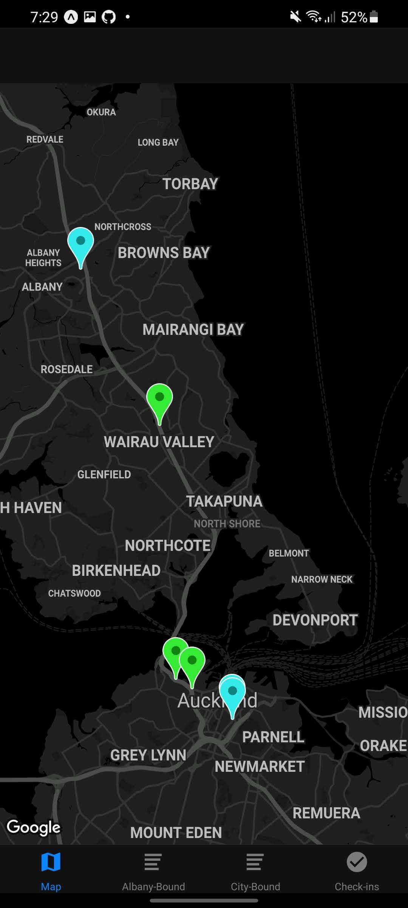
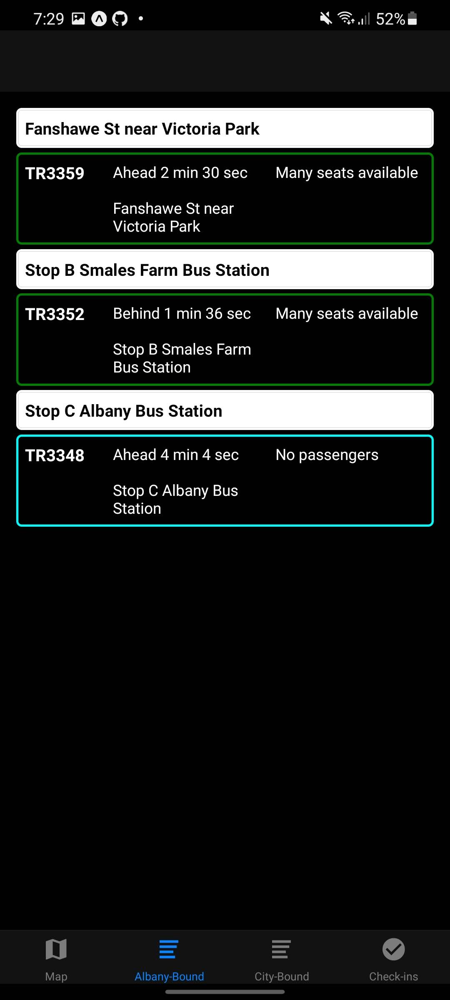
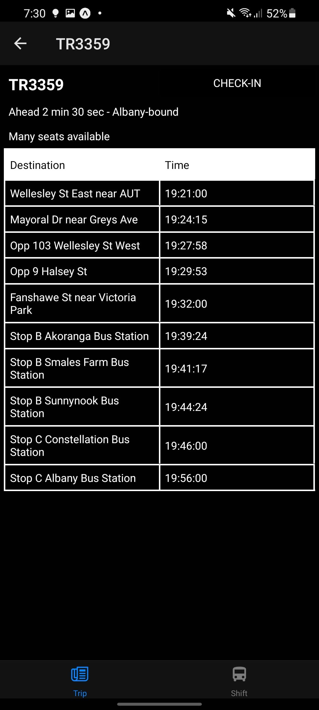

# TranzTracker Backend

Backend for TranzTracker mobile app. Built with Docker, Node.js and MongoDB.
Note that rosters are not provided due to privacy reasons.
You can download the app via the Expo app on iPhone and Android [here.](https://expo.io/@david.cole1340/projects/TranzTracker)

| Map Page | Bus List | Bus Info |
:---------:|:--------:|:---------:
|  |  |  |

## License

All source code provided in this repository is licensed under the [GNU Affero General Public License Version 3.0 or Later](https://www.gnu.org/licenses/agpl-3.0.en.html) which can be viewed in the LICENSE.md file in the root of this repository.

## Credits

- [David Cole](mailto:david.cole1340@gmail.com)
